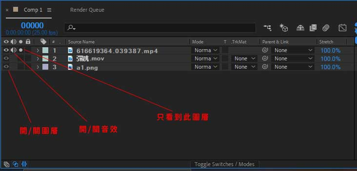

# Adobe_AE

## Adobe_AE是什麼?

正確名稱為Adobe After Effects，他允許使用者以2D或3D中的各種內建工具和第三方外掛程式(插件)創建動畫

## 基本介面介紹

## 基本操作

### 導入素材

點選File(檔案)->Improt(導入)->File(檔案) 快捷鍵為Ctrl+I

選擇需要匯入的檔案，在按Import即可匯入

或是以拖拉方式即可將素材拉入素材視窗

放開素材就出現了

### 新建合成

點選Composition(合成)->New Composition(新建合成) 快捷鍵為Ctrl+N，即可新增一個空白的合成影片

按下會出現Composition Settings，合成設定的視窗

Composition Name 合成名稱 - 設定合成的名稱

Preset 視訊格式預設集 - 提供您選擇常用的視訊格式。

Width 寬度 / Height 高度 - 設定影格的寬度與高度，若您已經從 Preset 預設集選取，就不需要再自行輸入。

Pixel Aspect Ratio 像素長寬比

Frame Rate 影格速率 - 每秒播放的影格數，29.97是最接近人體肉眼動態辨識

Resolution 解析度 - 設定視訊的解析度。

Start Timecode ： 設定起始的時間碼

Duration ： 設定合成的時間長度

在Basic((基本)旁邊有兩個標籤

一個是Advanced(進階設定)，一個是3D Renderer(3D進階設定)是比較後期才會用到的設置，目前先不說

按下OK就會跳出空的合成圖層工作檯

也可以拖拉素材至新建合成按鈕上，創建此素材的新合成圖層

就會出現以拖拉選擇的素材為基底的合成圖層

### 時間軸面板

左邊圖層區：以下圖顯示為例，有些影片會有音效，而圖片沒有，可在素材開頭選擇需要開啟或者關閉的效果

左下方有可開啟隱藏其他功能的按鈕

右邊時間軸區：會依照左邊圖層區依序排列時間軸，若想控制時間刻度顯示的範圍，可利用播放軸拖拉或者左下
的縮放圖示

### 資訊面板

顯示滑鼠游標的座標位置與像素 RGB 值等資訊

### 預視面板

用於預視合成的編輯效果，記憶體預覽功能可以接近即時觀看編輯的視訊

### 特效與預設面板

可以為圖層加入特效，After Effects 本身提供很多的特效，可以輸入關鍵字來搜尋需要使用的特效項目。此外，After Effects 可以安裝協力廠商開發的外掛程式以增加更多的特效

